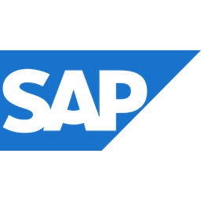

## Hi there! I'm Yasemin! 👋 

​Data Analyst with 5+ years of professional experience in data analytics, business intelligence, and data engineering. Passionate about transforming raw data into actionable insights.

## Skills 💻​ 

Data Visualization · Data Cleaning · Data Analysis · ETL · Business Process Analysis · BPMN 2.0

## Languages & Tools 🛠️

  
  
  
 
  

## Education 🎓

- M.Sc. in Data and Knowledge Engineering, Hacettepe University
- B.Sc. in Food Engineering, Hacettepe University

## Connect with me 🔗
 
📧 <a href="yaseminkutuk@outlook.com">yaseminkutuk@outlook.com</a>
